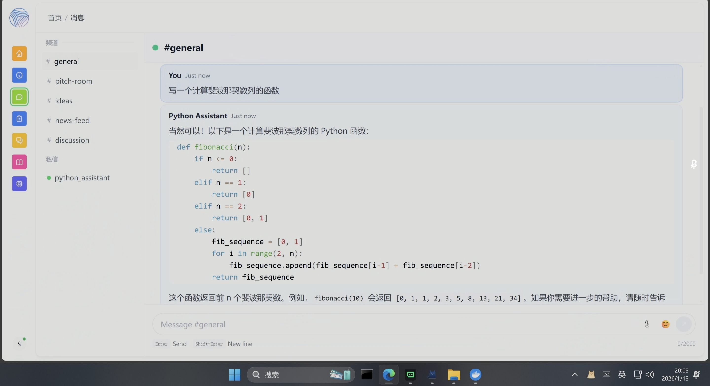

# Python Assist Network - Multi-Agent Hackathon 2025


## 1. 项目概述 (Project Overview)
- **项目名称**: Python Assist Network
- **Network ID**: `python-assist-network` (默认配置)
- **一句话简介**: 这是一个专为 Python 开发者打造的智能体网络，提供实时的代码生成、调试辅助和编程咨询服务。
- **目标用户/使用场景**: 
  - **初学者**: 需要解释代码逻辑、学习 Python 语法。
  - **开发者**: 需要快速生成样板代码、排查 Bug 或优化算法。
  - **数据科学家**: 需要 Pandas/Numpy 数据处理代码片段。

## 2. 技术架构 (Technical Architecture)
- **技术栈**:
  - **核心框架**: OpenAgents (v0.8.5+)
  - **语言**: Python 3.10+
  - **通信协议**: gRPC (Agent 间通信), HTTP (Studio 交互)
  - **大模型**: 兼容 OpenAI 接口的高性能 LLM (如 Qwen3-8B, GLM-4 等)
- **设计思路**:
  采用 OpenAgents 的 `CollaboratorAgent` 架构，构建一个轻量级但功能强大的单智能体网络（未来可扩展）。通过 `openagents.mods.workspace.messaging` 模块实现与人类用户的自然语言交互，利用 `openai-compatible` 提供商接口灵活接入各种推理后端。
- **架构简述**:
  `User (Studio)` <--> `OpenAgents Network` <--> `Python Assistant Agent` <--> `Custom LLM Backend`

## 3. 智能体设计 (Agent Design)
本项目目前包含一个核心智能体：

### 🐍 Python Assistant (`python_assistant`)
- **角色**: 资深 Python 编程助手
- **功能**:
  - 理解用户的编程需求。
  - 生成清晰、可执行的 Python 代码片段。
  - 解释复杂的代码逻辑。
  - 提供代码优化建议。
- **配置**:
  - 基于 `CollaboratorAgent` 类型。
  - 使用 `openai-compatible` 模式，允许用户自定义 Base URL 和 API Key。
  - 启用了 `messaging` mod 以支持即时通讯。

## 4. 协作场景与创新点 (Collaboration & Innovation)
- **协作场景**:
  用户在 OpenAgents Studio 中提出需求（例如：“帮我写一个爬取网页标题的脚本”），Python Assistant 接收消息，调用后端大模型进行推理，并返回带有注释的代码块。
- **创新点**:
  - **灵活的后端集成**: 打破了对特定模型供应商的依赖，通过自定义配置支持接入本地模型（如 Ollama）或第三方聚合 API，降低了使用成本并提高了数据隐私性。
  - **一键部署**: 针对 Hackathon 场景优化了部署流程，提供 Windows/Linux 双平台的一键启动脚本，极大地降低了环境搭建门槛。

## 5. 实际应用价值 (Value)
- **解决了什么问题**: 
  解决了开发者在编码过程中频繁切换浏览器搜索代码片段的低效问题，提供了一个集成在 Agent 网络中的专属编程专家。
- **可扩展性**:
  - **横向扩展**: 可以轻松添加 `Code Reviewer`（代码审查员）或 `Unit Test Generator`（单元测试生成器）等 Agent，形成流水线协作。
  - **能力扩展**: 未来可接入 `Tool Use` 能力，允许 Agent 直接在沙箱中运行代码并返回结果。

## 6. 开发、发布与使用说明 (Development & Usage)

### 环境依赖
- 操作系统: Windows 10/11 或 Linux (Ubuntu/CentOS)
- Python: 3.10 或更高版本

### 安装与运行步骤
1. **克隆代码仓库**:
   ```bash
   git clone https://github.com/yumo666666/python_assistant.git
   cd python_assistant
   ```

2. **配置密钥**:
   - 打开 `run_openagents.bat` (Windows) 或 `run_openagents.sh` (Linux)。
   - 找到以下行并修改为你自己的配置：
     ```bash
     # Windows
     set OPENAI_BASE_URL=https://your-custom-endpoint.com/v1
     set OPENAI_API_KEY=sk-your-api-key
     
     # Linux
     export OPENAI_BASE_URL="https://your-custom-endpoint.com/v1"
     export OPENAI_API_KEY="sk-your-api-key"
     ```
   > **注意**: 请勿将包含真实 API Key 的文件提交到公开仓库！

3. **启动服务**:
   - **Windows**: 双击运行 `run_openagents.bat`。
   - **Linux**:
     ```bash
     chmod +x run_openagents.sh
     ./run_openagents.sh
     ```

4. **使用**:
   - 打开浏览器访问 `http://localhost:8050`。
   - 在 Studio 中选择 `python_assistant` 并开始对话。

## 7. 团队与分工 (Team)
- **参赛形式**: 个人参赛
- **成员**: [你的名字/ID]
- **分工**: 全栈开发（环境搭建、Agent 配置、脚本编写、文档撰写）。

## 8. 遇到的挑战与解决方案 (Challenges & Solutions)
- **挑战 1**: **自定义模型接入问题**。OpenAgents 默认对特定模型名称有自动路由逻辑，导致使用非标准模型名时连接失败。
  - **解决方案**: 深入分析源码，强制指定 `provider: "openai-compatible"` 并在配置文件中显式锁定 `api_base`，成功绕过了自动路由机制。
- **挑战 2**: **跨平台部署**。Windows 和 Linux 的环境配置命令差异较大。
  - **解决方案**: 编写了适配两种系统的独立启动脚本，利用 `nohup` (Linux) 和 `start` (Windows) 实现了后台进程管理。

## 9. 未来展望 (Future)
- **接入代码执行环境**: 集成 Jupyter Kernel 或 Docker 沙箱，让 Agent 不仅能写代码，还能运行代码并反馈结果。
- **多 Agent 协作**: 引入“架构师”Agent 负责拆解任务，由“程序员”Agent 编写代码，再由“测试”Agent 进行验证，实现全自动软件开发流程。
- **知识库增强**: 挂载最新的 Python 文档知识库（RAG），确保生成的代码符合最新版本规范。
